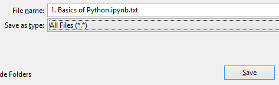

# PythonTutorials

This repository does not contain all the contents right now!

Do not rely completely till I complete it.

### How to save files on system
1. Either clone the whole repository.

2. OR Open the file that you want to save >> click on "Raw" button >> Press "[Ctrl] + S".

**DO NOT SAVE THE FILE AS .TXT Change the** `Save as file` **Option to** `All files` **before saving**
**Remove** `.txt` **from the file name**

**The saved file should have extension .ipynb**

